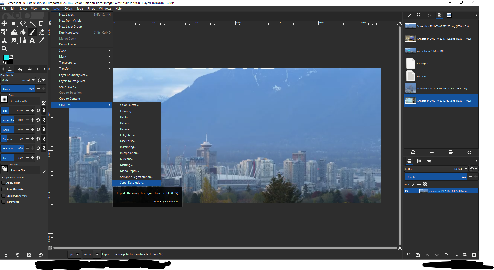

# GIMP-ML
Set of Machine Learning Python plugins for GIMP. 

The plugins have been tested with GIMP 2.10 on the following machines: <br>
[1] macOS Catalina 10.15.4 <br>
[2] ubuntu 18.04 LTS <br>
[3] ubuntu 20.04 LTS <br>
[4] Debian GNU/Linux 10 (buster)

# Screenshot of Menu


# Installation Steps
[1] Install [GIMP](https://www.gimp.org/downloads/). <br>
[2] Clone this repository: `git clone https://github.com/kritiksoman/GIMP-ML.git` <br>
[3] Run `./install.sh` <br>
[4] Open GIMP and go to Preferences -> Folders -> Plug-ins, add the folder `GIMP-ML/plugins` and restart GIMP. <br>

# Demo videos on YouTube
[](http://www.youtube.com/watch?v=q9Ny5XqIUKk)
[](http://www.youtube.com/watch?v=kXYsWvOB4uk)

[](http://www.youtube.com/watch?v=HVwISLRow_0)
[](http://www.youtube.com/watch?v=U1CieWi--gc) 

[](http://www.youtube.com/watch?v=HeBgWcXFQpI)
[](http://www.youtube.com/watch?v=adgHtu4chyU) 

[](http://www.youtube.com/watch?v=thS8VqPvuhE) 

# References
### MaskGAN
* Source: https://github.com/switchablenorms/CelebAMask-HQ
* Torch Hub fork: https://github.com/valgur/CelebAMask-HQ
* License:
   * [CC BY-NC-SA 4.0](https://creativecommons.org/licenses/by-nc-sa/4.0/legalcode)
   * Copyright (C) 2017 NVIDIA Corporation. All rights reserved. 
   * Restricted to non-commercial research and educational purposes
* http://arxiv.org/abs/1907.11922
* C.-H. Lee, Z. Liu, L. Wu, and P. Luo, “MaskGAN: Towards Diverse and Interactive Facial Image Manipulation,”
in *IEEE Conference on Computer Vision and Pattern Recognition (CVPR)*, 2019.

### Face Parsing
* Source: https://github.com/zllrunning/face-parsing.PyTorch
* Torch Hub fork: https://github.com/valgur/face-parsing.PyTorch
* License: [MIT](https://github.com/zllrunning/face-parsing.PyTorch/blob/master/LICENSE)
* Based on BiSeNet:
   * https://github.com/CoinCheung/BiSeNet
   * License: [MIT](https://github.com/CoinCheung/BiSeNet/blob/master/LICENSE)
   * http://arxiv.org/abs/1808.00897
   * C. Yu, J. Wang, C. Peng, C. Gao, G. Yu, and N. Sang, “BiSeNet: Bilateral segmentation network for
     real-time semantic segmentation,” in Lecture Notes in *Computer Science (including subseries Lecture Notes in 
     Artificial Intelligence and Lecture Notes in Bioinformatics)*, 2018, vol. 11217 LNCS, pp. 334–349.

### SRResNet
* Source: https://github.com/twtygqyy/pytorch-SRResNet
* Torch Hub fork: https://github.com/valgur/pytorch-SRResNet
* License: [MIT](https://github.com/twtygqyy/pytorch-SRResNet/blob/master/LICENSE)
* http://arxiv.org/abs/1609.04802
* C. Ledig et al., “Photo-Realistic Single Image Super-Resolution Using a Generative Adversarial Network,”
  in *2017 IEEE Conference on Computer Vision and Pattern Recognition (CVPR)*, 2017, pp. 105–114.

### DeblurGANv2
* Source: https://github.com/TAMU-VITA/DeblurGANv2
* Torch Hub fork: https://github.com/valgur/DeblurGANv2
* License: [BSD 3-clause](https://github.com/TAMU-VITA/DeblurGANv2/blob/master/LICENSE)
* https://arxiv.org/abs/1908.03826
* O. Kupyn, T. Martyniuk, J. Wu, and Z. Wang, “DeblurGAN-v2: Deblurring (Orders-of-Magnitude) Faster and Better,”
  in *2019 IEEE/CVF International Conference on Computer Vision (ICCV)*, 2019, pp. 8877–8886.

### Monodepth2
* Source: https://github.com/nianticlabs/monodepth2
* Torch Hub fork: https://github.com/valgur/monodepth2
* License:
   * See the [license file](https://github.com/nianticlabs/monodepth2/blob/master/LICENSE) for terms
   * Copyright © Niantic, Inc. 2019. Patent Pending. All rights reserved.
   * Non-commercial use only
* http://arxiv.org/abs/1806.01260
* C. Godard, O. Mac Aodha, M. Firman, and G. Brostow, “Digging Into Self-Supervised Monocular Depth Estimation,”
  in *2019 IEEE/CVF International Conference on Computer Vision (ICCV)*, 2019, pp. 3827–3837.

### Neural Colorization
* Source: https://github.com/zeruniverse/neural-colorization
* Torch Hub fork: https://github.com/valgur/neural-colorization
* License:
   * [GNU GPL 3.0](https://github.com/zeruniverse/neural-colorization/blob/pytorch/LICENSE) for personal or research use
   * Commercial use prohibited
   * Model weights released under [CC BY 4.0](https://creativecommons.org/licenses/by/4.0/)
* Based on fast-neural-style:
   * https://github.com/jcjohnson/fast-neural-style
   * License:
      * Free for personal or research use
      * For commercial use please contact the authors
   * https://cs.stanford.edu/people/jcjohns/papers/eccv16/JohnsonECCV16.pdf
   * J. Johnson, A. Alahi, and L. Fei-Fei, “Perceptual Losses for Real-Time Style Transfer and Super-Resolution,”
     in *Lecture Notes in Computer Science (including subseries Lecture Notes in Artificial Intelligence and Lecture Notes in Bioinformatics)*,
     vol. 9906 LNCS, 2016, pp. 694–711.

# Common Issues
[1] GIMP-ML menu not visible: Do following and restart GIMP.<br>
```
sudo apt install gimp-python
cd gimp-plugins
chmod -x *
chmod +x *.py
```
[2] colorize plugin not working: Switch to grayscale mode before running plugin. (Image->Mode->Grayscale)

# Authors
* Kritik Soman ([kritiksoman](https://github.com/kritiksoman))
* Martin Valgur ([valgur](https://github.com/valgur))

# License
MIT

Please note that additional license terms apply for each individual model. See the [references](#references) list for details.
Many of the models restrict usage to non-commercial or research purposes only.


# Citation
If you use GIMP-ML, please cite the following [arXiv preprint](https://arxiv.org/abs/2004.13060):

```
@article{soman2020GIMPML,
  title={GIMP-ML: Python Plugins for using Computer Vision Models in GIMP},
  author={Soman, Kritik},
  year={2020},
  archivePrefix={arXiv},
  arxivId={2004.13060},
  eprint={2004.13060}
}
```
